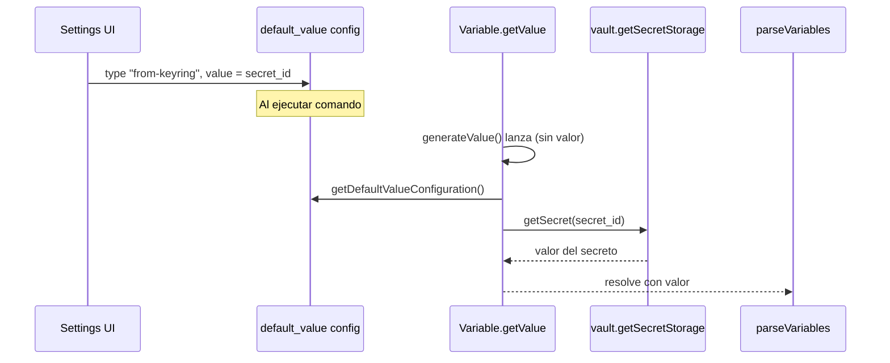

# Plan: Default value "From Keyring" en Shell Commands

## Objetivo

Permitir que el valor por defecto de una variable (custom o built-in) provenga del Keyring de Obsidian: el usuario elige "From Keyring" en el desplegable y selecciona un secreto por nombre con SecretComponent; en ejecución se resuelve con `SecretStorage.getSecret(secret_id)`.

## Flujo de datos

## Cambios por archivo

### 1. Tipos y resolución del default "from-keyring"

**Archivo:** [src/variables/Variable.ts](src/variables/Variable.ts)

- **VariableDefaultValueType** (aprox. línea 511): añadir `"from-keyring"` al tipo.
- **Variable.getValue()** (aprox. líneas 61-152): en el `switch (default_value_type)` del `catch`, añadir un `case "from-keyring"` que:
  - Compruebe que `default_value_configuration` existe y que `default_value_configuration.value` es el `secret_id`.
  - Si existe un parámetro opcional que indique "solo para preview" (ver punto 4), resolver con un placeholder (ej. `"[from Keyring]"`) sin llamar a SecretStorage.
  - Si no es preview: obtener SecretStorage (`this.app.vault.getSecretStorage()` — comprobar nombre exacto en API de Obsidian), llamar `await secretStorage.getSecret(secret_id)`. Si el secreto no existe (null/undefined), resolver con `succeeded: false` y un mensaje claro ("Secret 'X' not found in Keyring"). Si existe, resolver con `value: secret` y `succeeded: true`. No aplicar `default_value_parser` al valor del Keyring (es literal).
- Añadir un **parámetro opcional** a `getValue()` para "preview" (ver sección Preview más abajo).

**Nota:** Si la API de Obsidian expone SecretStorage por otra vía (p. ej. `app.vault`), usar la que esté documentada/typed. Comprobar en `node_modules` o en la documentación el método exacto (p. ej. `getSecretStorage()`).

---

### 2. UI: opción en el desplegable y SecretComponent

**Archivo:** [src/settings/setting_elements/createVariableDefaultValueFields.ts](src/settings/setting_elements/createVariableDefaultValueFields.ts)

- **defaultValueTypeOptions** (aprox. líneas 154-160): añadir entrada `"from-keyring": "Execute with value from Keyring"` (o "From Keychain").
- **Inherit (solo tShellCommand):** en el bloque `case "tShellCommand"`, al construir el texto de "Inherit" cuando el tipo global es `"from-keyring"`, no usar el valor del secreto; usar algo como `"Inherit: From Keyring"` (líneas 164-168).
- **Visibilidad del control de valor:** hoy se muestra/oculta solo el textarea según `type === "value"`. Extender la lógica para que:
  - `"value"`: se muestre el textarea (valor literal).
  - `"from-keyring"`: se oculte el textarea y se muestre un **SecretComponent** para elegir el secreto.
- **SecretComponent:** usar `Setting.addComponent()` (la documentación de Obsidian indica que SecretComponent se instancia con `app` y el contenedor). Obtener SecretStorage desde `plugin.app.vault.getSecretStorage()` (o equivalente) y crear `new SecretComponent(plugin.app, containerEl)` (comprobar firma en la API). Al cambiar la selección, asignar `defaultValueConfiguration.type = "from-keyring"` y `defaultValueConfiguration.value = secretId` (el id devuelto por SecretComponent), luego `plugin.saveSettings()` y `onChange?.()`.
- **Compatibilidad de versión:** si `vault.getSecretStorage` no existe (Obsidian &lt; 1.11.4), no añadir la opción "from-keyring" al dropdown (o añadirla deshabilitada con tooltip "Requires Obsidian 1.11.4+"). Usar comprobación en runtime (p. ej. `if (typeof plugin.app.vault.getSecretStorage === 'function')`) o `requireApiVersion("1.11.4")` según convenga; si se usa requireApiVersion, considerar subir `minAppVersion` en manifest o documentar que la opción solo aparece en 1.11.4+.
- **Creación de configuración:** en `createDefaultValueConfiguration()` (aprox. 116-121), el tipo por defecto puede seguir siendo `"show-errors"`; no hace falta valor por defecto especial para "from-keyring".
- **Limpieza al cambiar tipo:** al pasar a "show-errors" (o "cancel-silently") con `value` vacío, ya se borra la config; al pasar a "from-keyring", el `value` se rellenará con el SecretComponent. Opcional: al cambiar desde "from-keyring" a "value", limpiar `value` para no dejar el secret_id como texto.

---

### 3. Preview: no exponer el secreto

**Objetivo:** En la vista previa del comando (settings y command palette / Prompt modal), el valor de variables con default "from-keyring" no debe ser el secreto real.

- **Variable.getValue():** añadir un parámetro opcional al final, por ejemplo `options?: { forPreview?: boolean }`. Cuando `forPreview === true` y el flujo entra en el `case "from-keyring"`, resolver con `value: "[from Keyring]" `(o similar) y `succeeded: true`, sin llamar a `getSecret()`.
- **parseVariables:** añadir un parámetro opcional `forPreview?: boolean` (por ejemplo después de `escaped_value_augmenter`). Al llamar a `variable.getValue(..., default_value_parser, { forPreview })`, pasar ese flag. En la llamada recursiva a `parseVariables` (para default values), pasar el mismo `forPreview`.
- **Callers que son preview:**
  - [src/settings/setting_elements/CreateShellCommandFieldCore.ts](src/settings/setting_elements/CreateShellCommandFieldCore.ts): en `getShellCommandPreview`, llamar a `parseVariables(..., { forPreview: true })` (o el orden de parámetros que se defina).
  - [src/models/prompt/PromptModal.ts](src/models/prompt/PromptModal.ts): en el bloque que genera el texto de vista previa del comando (aprox. línea 172), donde se llama a `parseVariables` para el shell command preview, pasar `forPreview: true`.

Así solo en ejecución real se llama a `getSecret()`; en previews se muestra el placeholder.

---

### 4. Secret no encontrado

- En el `case "from-keyring"` de `Variable.getValue()`: si `getSecret(secret_id)` devuelve `null` o `undefined`, resolver con `succeeded: false` y `error_messages` con un mensaje claro (ej. "Secret '&lt;secret_id&gt;' not found in Keyring"). No usar el contenido previo de `value` como respaldo.

---

### 5. Manifest y compatibilidad

- **manifest.json:** Actualmente `minAppVersion` es `"1.4.0"`. Opciones:
  - **A)** Subir a `"1.11.4"` si se quiere soporte solo en versiones con SecretStorage.
  - **B)** Dejar `minAppVersion` y que la opción "From Keyring" solo se muestre/habilite cuando `app.vault.getSecretStorage` exista (evitar errores en versiones antiguas).
- Recomendación: **B** para no romper usuarios en Obsidian antiguo; documentar que "From Keyring" requiere Obsidian 1.11.4+.

---

### 6. Migraciones

- No es necesario migrar configuraciones existentes: los `default_value` actuales siguen siendo `type` "show-errors" | "cancel-silently" | "value". Si en el futuro se renombra el tipo "from-keyring", se puede añadir una migración en [src/Migrations.ts](src/Migrations.ts); por ahora no hace falta.

---

## Orden sugerido de implementación

1. Variable.ts: extender tipo y añadir parámetro `forPreview` a `getValue`; implementar `case "from-keyring"` (con placeholder cuando `forPreview`).
2. parseVariables.ts: añadir parámetro `forPreview` y pasarlo a `getValue`.
3. CreateShellCommandFieldCore.ts y PromptModal.ts: pasar `forPreview: true` en las llamadas de preview.
4. createVariableDefaultValueFields.ts: añadir opción "from-keyring", lógica de visibilidad textarea vs SecretComponent, y uso de SecretComponent con comprobación de API.
5. manifest.json (opcional): documentar o ajustar `minAppVersion` según se elija A o B.

---

## Resumen de archivos a tocar

| Archivo | Cambios |

|---------|--------|

| [src/variables/Variable.ts](src/variables/Variable.ts) | Tipo `from-keyring`, parámetro opcional en `getValue`, case con getSecret y placeholder en preview |

| [src/variables/parseVariables.ts](src/variables/parseVariables.ts) | Parámetro `forPreview` y pasarlo a `getValue` (y en recursión) |

| [src/settings/setting_elements/createVariableDefaultValueFields.ts](src/settings/setting_elements/createVariableDefaultValueFields.ts) | Opción en dropdown, visibilidad textarea/SecretComponent, uso de SecretComponent, inherit para from-keyring |

| [src/settings/setting_elements/CreateShellCommandFieldCore.ts](src/settings/setting_elements/CreateShellCommandFieldCore.ts) | Llamar a parseVariables con `forPreview: true` en getShellCommandPreview |

| [src/models/prompt/PromptModal.ts](src/models/prompt/PromptModal.ts) | Pasar `forPreview: true` en la llamada a parseVariables del preview del comando |

| [manifest.json](manifest.json) | Opcional: documentar o subir minAppVersion |